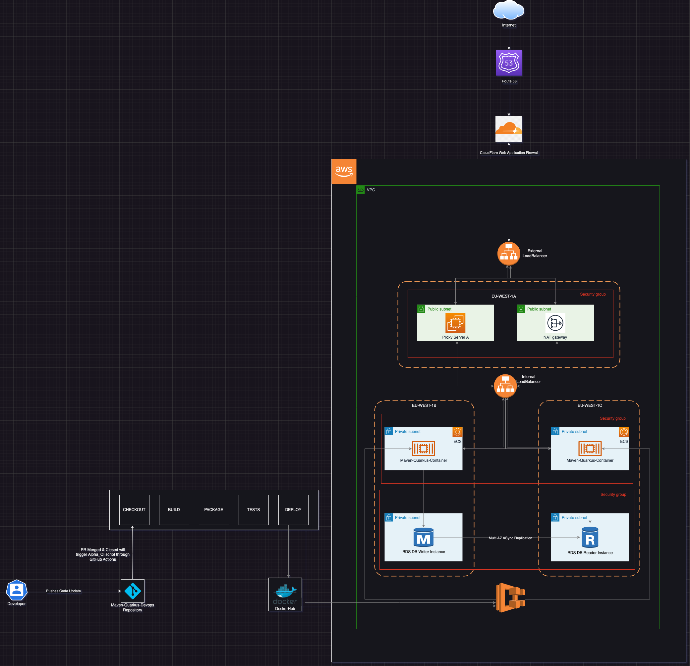

# Maven Quarkus Project

This project uses Quarkus, the Supersonic Subatomic Java Framework.

If you want to learn more about Quarkus, please visit its website: https://quarkus.io/ .

## Running the application in dev mode

You can run your application in dev mode that enables live coding using:
```shell script
./mvnw compile quarkus:dev
```

> **_NOTE:_**  Quarkus now ships with a Dev UI, which is available in dev mode only at http://localhost:8080/q/dev/.

## Packaging and running the application

The application can be packaged using:
```shell script
./mvnw package
```
It produces the `quarkus-run.jar` file in the `target/quarkus-app/` directory.
Be aware that it’s not an _über-jar_ as the dependencies are copied into the `target/quarkus-app/lib/` directory.

The application is now runnable using `java -jar target/quarkus-app/quarkus-run.jar`.

If you want to build an _über-jar_, execute the following command:
```shell script
./mvnw package -Dquarkus.package.type=uber-jar
```

The application, packaged as an _über-jar_, is now runnable using `java -jar target/*-runner.jar`.

## Creating a native executable

You can create a native executable using: 
```shell script
./mvnw package -Pnative
```

Or, if you don't have GraalVM installed, you can run the native executable build in a container using: 
```shell script
./mvnw package -Pnative -Dquarkus.native.container-build=true
```

You can then execute your native executable with: `./target/test-1.0.0-SNAPSHOT-runner`

If you want to learn more about building native executables, please consult https://quarkus.io/guides/maven-tooling.

## Related Guides

- RESTEasy Classic JSON-B ([guide](https://quarkus.io/guides/rest-json)): JSON-B serialization support for RESTEasy Classic
- RESTEasy Classic ([guide](https://quarkus.io/guides/resteasy)): REST endpoint framework implementing Jakarta REST and more

## Provided Code

### RESTEasy JAX-RS

Easily start your RESTful Web Services

[Related guide section...](https://quarkus.io/guides/getting-started#the-jax-rs-resources)


# Build & Deployment Instructions
This project leverages on GitHub Actions For Continous Integration and Amazon ECS For The Continous Delivery. The CI Workflows can be found in ```./github/workflows/```.

### Architecture
This architecture shows the automated CI and CD process for this project.



## Folder Structure
```bash
├── Dockerfile
├── Maven-Quarkus-Devops.png
├── README.md
├── docker
│   ├── Dockerfile.jvm
│   ├── Dockerfile.legacy-jar
│   ├── Dockerfile.native
│   └── Dockerfile.native-micro
├── infrastructure_as_code
│   └── terraform
│       ├── dev.tfvars
│       ├── main.tf
│       ├── modules
│       │   ├── ec2
│       │   ├── ecs
│       │   ├── loadbalancing
│       │   ├── logging
│       │   └── networking
│       ├── providers.tf
│       └── variables.tf
├── mvnw
├── mvnw.cmd
├── pom.xml
├── src
│   ├── main
│   │   ├── java
│   │   └── resources
│   └── test
└── target
```

### Running the application in Docker
To Execute the application as a container, first pull the image;

```bash
docker pull kr00deapp/e-transact-devops:latest
```

Then execute the container using the command below;
```bash
docker run -i --rm -p 8080:8080 e-transact-devops:latest
```

## Continous Integration Instructions
You will need to setup the appropriate credentials for this workflow to work properly. You can find the complete list of secrets needed for this workflow below;
| Environment Variable | Description |
| ---------------------| ----------- |
| ```DOCKERHUB_USERNAME```    | Username Of DockerHub Account |
| ```DOCKERHUB_TOKEN```       | UserToken Generated For The DockerHub User |
| ```SLACK_WEBHOOK```         | Slack WebHook URL For Notifications Through Slack |
| ```ECS_SERVICE```           | Service name for Elastic Container Service |
| ```ECS_CLUSTER```           | Cluster name for Elastic Container Service |
| ```AWS_REGION```            | Desired AWS region |
| ```ECS_TASK_DEFINITION```   | Path To your ECS Task Definition JSON file as directed by the documentation provided |
| ```CONTAINER_NAME```        | Contatiner name from the ECS Task Definition JSON file |

-------------------------------
## How The CI is Triggered
After A Pull Request is closed and merged into the main branch, the main repo is checked out and the build process begins.

Maven Builds the Executable jar package with Java 17 and Exports the artifacts to the targets directory.

A Docker Image is then created from the built artifact for simplicity and shipped to dockerhub for storage and deployment.

### Deploying To Elastic Container Service.
The workflow deploys the built docker image to Amazon's Elastic Container Orchestration Service. 

## Notifications
The CI uses Slack as a means of notifying build status to the appropriate party through a channel.

## First Time Setup
To Setup for the very first time, follow these steps closely;
```bash
cd infrastructure_as_code #swirch working directory to the IAC direcotory

terraform init # To initialize the terraform project

terraform workspace new development # Switch to the newly created development workspsace

terraform plan -var-file development.tfvars  # Generate a plan for your infrastructure

terraform apply -var-file development.tfvars -auto-approve   #Apply plan and auto approve apply action.
```

### Deployment Procedure
GitHub actions will execute the workflow file automatically whenever the repository's conditions are met... thus, whenever a pull request is merged and closed to the main branch.

The workflow will authenticate with AWS, update the templated task definition file, and deploy the update to ECS Service once the AWS environment has been setup.


### Acknowledgements
Author: Christopher Junior Afeku [BlackOps ❄️] <br>
Connect on [GitHub](https://github.com/DO-Christopher) or [LinkedIn](https://www.linkedin.com/in/chris-jnr/)

